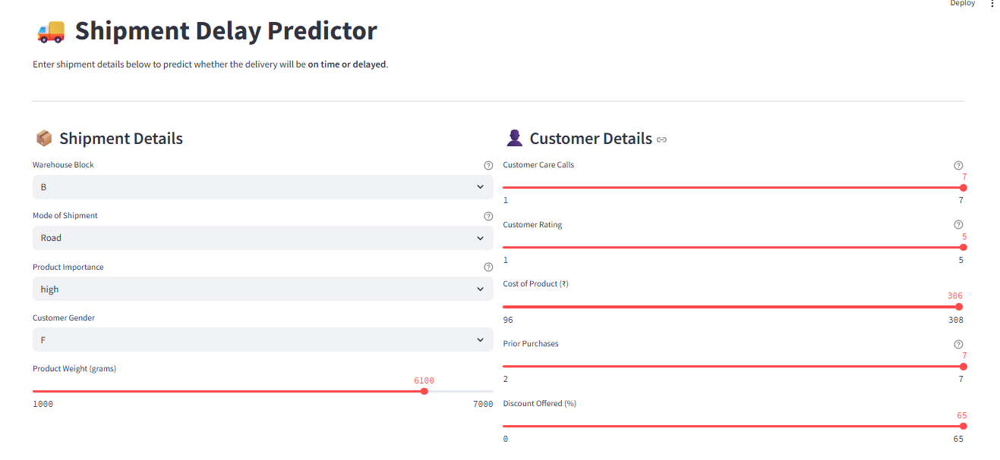
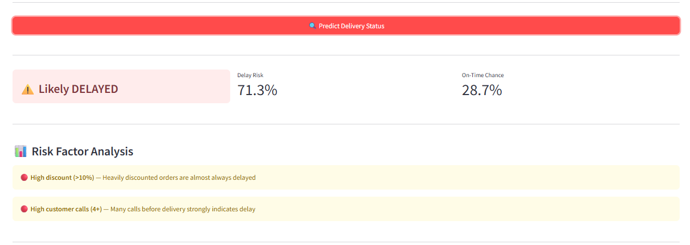
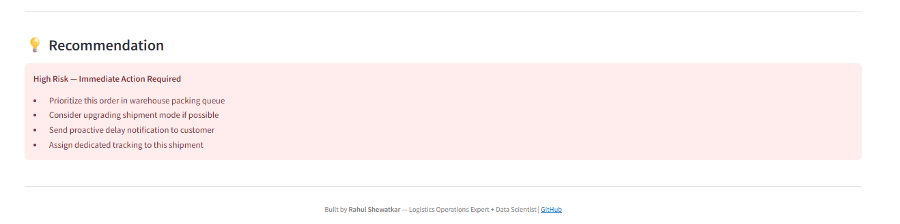

# 🚚 Shipment Delay Predictor

A complete end-to-end Machine Learning project that predicts whether a shipment will be delayed — before it leaves the warehouse.
Built to help logistics and courier companies reduce late deliveries, improve customer satisfaction, and take proactive action.

---

## 🎯 Problem Statement

In the logistics industry, late deliveries cost companies in refunds, re-deliveries, and lost customers.
This project uses historical shipment data to **predict delay risk at the time of booking**, giving operations teams a chance to act before a problem becomes a complaint.

> **Key finding:** 59.7% of shipments in the dataset were delayed. This model identifies the top contributing factors and flags high-risk orders proactively.

---

## 📊 Dataset

- **Source:** [E-Commerce Shipping Dataset — Kaggle](https://www.kaggle.com/datasets/prachi13/customer-analytics)
- **Size:** 10,999 rows × 12 columns
- **Target variable:** `Reached.on.Time_Y.N` (1 = Late, 0 = On Time)

### Key Features Used

| Feature | Description |
|---|---|
| `Warehouse_block` | Warehouse section (A–F) |
| `Mode_of_Shipment` | Ship, Flight, or Road |
| `Customer_care_calls` | Number of calls before delivery |
| `Weight_in_gms` | Product weight in grams |
| `Discount_offered` | Discount % on the order |
| `Prior_purchases` | Customer's order history count |
| `Product_importance` | low / medium / high |

---

## 🔍 Key Insights from EDA

- Products with **discount > 10%** are almost always delayed
- Shipments weighing **2–4 kg** show the highest delay rate
- **Ship mode** has the most delays compared to Flight and Road
- High **customer care calls (4+)** strongly correlate with late delivery
- These insights are directly used as engineered features in the model

---

## ⚙️ Feature Engineering

Three new features were created from EDA insights:

| Feature | Logic | Insight |
|---|---|---|
| `high_discount` | Discount > 10% → 1 | Almost guaranteed delay |
| `weight_bucket` | Weight grouped into 6 buckets | 2–4 kg has highest delay rate |
| `high_call_risk` | Calls >= 4 → 1 | Strong real-time delay signal |

---

## 🤖 Models Trained & Compared

| Model | Accuracy | Precision | Recall | F1 Score | AUC-ROC |
|---|---|---|---|---|---|
| Logistic Regression | — | — | — | — | — |
| Decision Tree | 64.18% | 69.57% | 71.06% | 70.31% | 62.53% |
| Random Forest (Tuned) | 66.32% | 77.82% | 60.93% | 68.35% | 73.49% |
| **XGBoost (Tuned) ✅** | **67.00%** | **73.77%** | **69.38%** | **71.51%** | **75.29%** |

> **Winner: XGBoost (Tuned)** — Best overall balance of Precision, Recall and AUC-ROC

---

## 💡 Business Impact

| Metric | Value |
|---|---|
| Shipments correctly flagged as delayed | 69.38% recall |
| Precision when flagging delay | 73.77% |
| Potential reduction in late deliveries | Est. 15–25% with proactive action |
| Target users | Operations manager, dispatch team |

**In plain English:** Out of every 10 shipments that will be late, the model correctly identifies 7 of them before they leave the warehouse — giving the operations team time to act.

---

## 📱 Streamlit Dashboard

An interactive dashboard where operations staff can enter shipment details and get instant delay predictions.

**Features:**
- Input form for all shipment parameters
- Delay risk percentage output
- Risk factor analysis (which factors are contributing)
- Plain English recommendation — High / Medium / Low risk action plan

**Run the dashboard:**
```bash
cd app
streamlit run app.py
```





## 🗂️ Project Structure

```
shipment-delay-predictor/
│
├── data/
│   ├── raw/                      # Original dataset (not tracked by Git)
│   └── processed/                # Cleaned and encoded data
│       ├── X_train.csv
│       ├── X_test.csv
│       ├── y_train.csv
│       └── y_test.csv
│
├── notebooks/
│   ├── EDA.ipynb                 # Exploratory Data Analysis — 7 charts
│   ├── preprocessing.ipynb       # Encoding, feature engineering, splitting
│   └── modeling.ipynb            # Model training, tuning, evaluation
│
├── src/
│   ├── utils.py                  # Shared paths, loaders, savers
│   ├── preprocess.py             # Full preprocessing pipeline
│   ├── predict.py                # Prediction on new single input
│   └── train.py                  # Model retraining script
│
├── models/
│   ├── best_model.pkl            # Saved XGBoost model
│   ├── label_encoders.pkl        # Encoders for categorical columns
│   └── scaler.pkl                # StandardScaler for numerical columns
│
├── reports/
│   ├── figures/                  # All EDA and model evaluation charts
│   │   ├── 01_target_distribution.png
│   │   ├── 02_delay_by_warehouse.png
│   │   ├── 03_delay_by_mode.png
│   │   ├── 04_discount_effect.png
│   │   ├── 05_weight_effect.png
│   │   ├── 06_customer_calls.png
│   │   ├── 07_correlation_heatmap.png
│   │   ├── 08_model_comparison.png
│   │   ├── 09_confusion_matrix.png
│   │   ├── 10_roc_curve.png
│   │   └── 11_feature_importance.png
│   │
│   └── scrennshots/              # All screenshots added here of stramlit dashborad
│       ├── dashboard-main.png
│       ├── dashboard-result.png
│       ├── dashboard-risk.png
│
├── app/
│   └── app.py                    # Streamlit dashboard
│
├── .gitignore
├── LICENSE
├── requirements.txt
└── README.md
```

---

## 🚀 How to Run

### 1. Clone the repository
```bash
git clone https://github.com/rshewatkar/shipment-delay-predictor.git
cd shipment-delay-predictor
```

### 2. Install dependencies
```bash
pip install -r requirements.txt
```

### 3. Download the dataset
Download from [Kaggle](https://www.kaggle.com/datasets/prachi13/customer-analytics) and place in:
```
data/raw/shipment-data.csv
```

### 4. Run notebooks in order
```bash
jupyter notebook notebooks/EDA.ipynb
jupyter notebook notebooks/preprocessing.ipynb
jupyter notebook notebooks/modeling.ipynb
```

### 5. Launch the Streamlit dashboard
```bash
cd app
streamlit run app.py
```

### 6. Retrain model from command line
```bash
cd src
python train.py
```

### 7. Test prediction from command line
```bash
cd src
python predict.py
```

---

## 🛠️ Tech Stack

| Category | Tools |
|---|---|
| Language | Python 3.11 |
| Data manipulation | Pandas, NumPy |
| Visualisation | Matplotlib, Seaborn |
| Machine learning | Scikit-learn, XGBoost |
| Dashboard | Streamlit |
| Model saving | Joblib |
| Version control | Git, GitHub |

---

## 📦 Requirements

```
pandas
numpy
matplotlib
seaborn
scikit-learn
xgboost
joblib
streamlit
jupyter
```

Install all:
```bash
pip install -r requirements.txt
```

---

## 👤 About the Author

**Rahul Shewatkar**
Data Science professional with 4+ years of prior experience in logistics operations — export documentation, air freight, and international shipping across US, Europe, and Asia.

This project combines deep logistics domain knowledge with machine learning skills to solve a real, high-impact problem in the courier and logistics industry.

- 📧 rshewatkar@gmail.com
- 💼 [LinkedIn](https://www.linkedin.com/in/rahul-shewatkar-ml-engineer/)
- 🐙 [GitHub](https://github.com/rshewatkar)

---

## 🏢 Target Companies

This solution is designed for courier and logistics companies including:
- DTDC Express Ltd.
- Delhivery Pvt Ltd.
- VRL Logistics Ltd.
- Blue Dart Express
- Gati Ltd.
- The Professional Couriers

---

## 📄 License

This project is open source and available under the [MIT License](LICENSE).